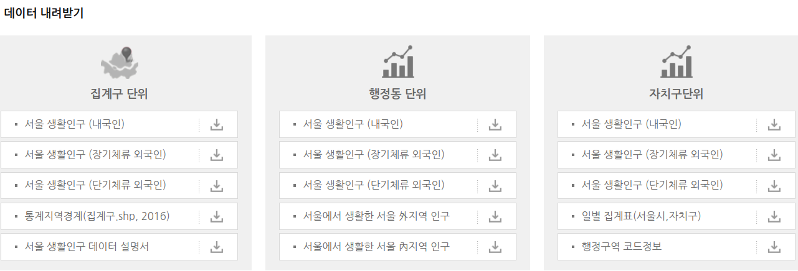
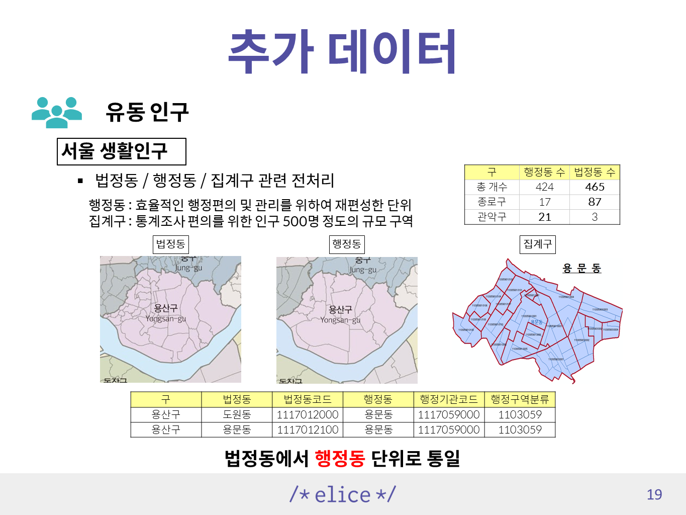

# 서울 생활인구(유동인구)

서울시와 KT가 공공빅데이터와 통신데이터(LTE시그널)를 이용하여 추계한 서울의 특정지역, 특정시점에 존재하는 모든 인구

참고 : LTE시그널데이터는 휴대폰 단말과 LTE기지국과 통신하는 이력을 수집한 데이터

( 전화, 문자 이력과 달리 자동으로 적재 / 휴대폰 소지자의 존재 위치와 이동 동선 파악에 용이)

서울 생활인구 페이지 : http://data.seoul.go.kr/dataVisual/seoul/seoulLivingPopulation.do

## 데이터의 종류

집계구 - 2017년 1월부터 정리된 파일을 다운로드 가능
행정동 - 2018년 3월부터 파일 다운로드 가능
자치구 - 파일형태 제공은 X

데이터의 단위 : 일 단위 CSV 파일( 약 2.5 GB )

|시간|컬럼|
|----|---|
|매일 매시간(0-23)|남 / 여 각각 5세 단위|

## 위치데이터 활용법

행정동코드와 집계구코드는 행정구역 데이터와 매칭하는 작업이 필요 

참고 코드 예시 ( 통계분류포털 행정구역으로 따로 정리한 데이터 ) - 맨 아래 참고내용에 링크가 있음

|구|법정동|법정동코드|행정동|행정기관코드|행정구역분류|
|--|--|--|--|--|--|
|용산구|	효창동|	1117011900|	효창동|	1117058000|	1103058|
|용산구	|도원동	|1117012000|	용문동|	1117059000	|1103059|

행정동코드 컬럼은 행정기관코드(10)를 사용 

주의 : 실제 데이터에는 마지막에 00이 붙어있지 않아 추가하는 작업이 필요할 수 있음

집계구코드 컬럼은 13자리이며, 행정구역분류코드( 7 ) + 6자리로 구성

## 특징

1. 개인정보 비식별화를 위하여 ‘3명’ 이하인 경우 “ * ” 처리.
2. 추정된 데이터로 소수점(5자리)이하 값이 있으며, 각 값의 합은 전체합계와 일치하지 않을 수 있음.

추가 : 사용한 데이터에서 NA는 없었음

### 동처리 시 문제점

주소에는 행정동과 법정동이 섞여서 사용되고 있어서 정확한 위치를 잡기 위해서는 GIS 프로그램을 활용할 줄 알아야 하는 거 같다.

참고 : ( 따릉이에서는 지도를 보면서 근처 기준으로 수작업으로 해결… )

### 용어정리

구역 범위 : 행정동 > 집계구 > 소지역

법정동 : 법으로 정해진 동( 일반적으로 사용하는 주소지 )

행정동 : 법정동의 크고 작음에 따라 효율적인 행정편의 및 관리를 위하여 재편성한 후 주민센터를 설치한 단위

집계구 : 통계조사 편의상 자료를 집계하기 위한 구역으로 인구 500명 정도의 규모이며, 크기는 읍면동의 약 1/25 크기이다.

소지역 : 집계구를 더 세분화한 단위

참고 : 법정동과 행정동 차이 ( 2010년 기준 지도 )

행정동이 많은 경우, 법정동이 많은 경우 편차가 심함

통계분류포털 행정구역 정의 다운로드 : https://kssc.kostat.go.kr:8443/ksscNew_web/kssc/main/main.do?gubun=1

